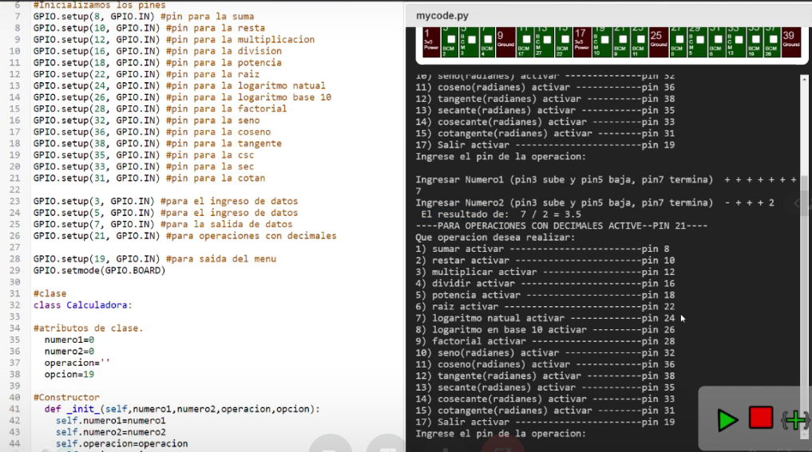

# Producto_Unidad2
# Informe 
##  NODE-RED que implemente una interfaz HMI (Interfaz Humano Máquina) y  el Diseño una calculadora científica en Python

## 1.PLANTEAMIENTO DEL PROBLEMA

Conocer  los diferentes nodos que nos ofrece la plataforma NODE-RED para poder implementarlos en una Interfaz Humano Máquina. Analizar los pines de la Raspberry Pi para poder usarlos en el programa de una calculadora científica por medio del lenguaje de programación Python

## 2.OBJETIVOS

### General:

Identificar las características de los nodos capaces de poder utilizarlos en una una interfaz HMI y las propiedades de los pines de la GPIO que nos ofrece la Raspberry Pi.

### Específicos:

> Explorar las bibliotecas de notas y de funciones que nos ofrecen NODE-RED y Python respectivamente.
 
> Comprender la sintaxis y la semántica de la programación orientada a objetos de Python.

## 3.ESTADO DEL ARTE

### Tema: Adquisición de datos desde plataforma IOT2040. Protocolos MODBUS/TCP y OPC UA

Investigadores: Calvo Luis, Borja.

Año: 2019

Este trabajo se basa en la adquisición de datos de un proceso automatizados desde dispositivo SIMATIC IOT2040 de SIEMENS, con diferentes protocolos industriales, mediante una plataforma de programación (Node-RED). Así, se posibilita la lectura, envió y procesamiento de datos de un proceso en un servidor remoto, facilitando la implementación de la industria 4.0 a través del Internet de las Cosas (IoT) a cualquier proceso automatizado futuro.
 
Lan hau automatizazio prozesu datuen eskuratzean oinarritzen da SIMATIC IOT2040 gailuaren bidez, protokolo industrial desberdinekin, programazio plataforma baten (Node-RED) bitartez. Horrela, prozesuko datuen irakurketa, bidalketa eta prozesaketa zerbitzari urrun batean posible egiten da, 4.0 industriaren inplementazioa erraztuz Gauzen Internetaren (IoT) bidez etorkizuneko edozein automatizazio prozesutarako.

Lugar: Universidad del País Vasco / Euskal Herriko Unibertsitatea.

### Tema: Programación de una librería de Python capaz de leer ficheros PDB para representar proteínas en 3D.

Investigadores: Cabrelles Muñoz.

Año:2018

Este proyecto tiene como finalidad el uso de librerías de Python para la visualización de estructuras proteicas tridimensionales mediante el procesado de archivos PDB. Para ello, se utilizaron las herramientas ofrecidas por BioPython para el procesado de datos, y las librerías matplotlib y VisPy para la visualización de los datos procesados. El resultado de este trabajo es un programa cuya interfaz gráfica fue creada mediante la librería Tkinter, que permite la selección del archivo a representar, la selección del motor que se utilizará para la visualización y qué tipo de visualización se generará (CPK, según el tipo de aminoácido al que pertenece, dividido en cadenas, y usando DSSP).

Lugar: Universitat Oberta de Catalunya, España.
 
## 4.MARCO TEÓRICO

 
### Node-RED
 
Node-RED es una herramienta de programación para conectar dispositivos de hardware, API y servicios en línea de formas nuevas e interesantes.
 
Proporciona un editor basado en navegador que facilita la conexión de flujos utilizando la amplia gama de nodos en la paleta que se pueden implementar en su tiempo de ejecución con un solo clic.
 

### Características de Node-RED
 
Node-RED proporciona un editor de flujo basado en navegador que facilita la conexión de flujos utilizando la amplia gama de nodos en la paleta. Los flujos se pueden implementar en tiempo de ejecución con un solo clic.
 
Las funciones de JavaScript se pueden crear dentro del editor utilizando un editor de texto enriquecido.
 
Una biblioteca incorporada le permite guardar funciones, plantillas o flujos útiles para su reutilización.
 
El tiempo de ejecución ligero se basa en Node.js, aprovechando al máximo su modelo sin bloqueo controlado por eventos. Esto lo hace ideal para ejecutarse en el borde de la red en hardware de bajo costo, como Raspberry Pi, así como en la nube.
 
Con más de 225,000 módulos en el repositorio de paquetes de Node, es fácil extender el rango de nodos de paleta para agregar nuevas capacidades.
 
### Comunidad  de Node-RED
 
Los flujos creados en Node-RED se almacenan utilizando JSON, que se puede importar y exportar fácilmente para compartir con otros.
 
Una biblioteca de flujo en línea le permite compartir sus mejores flujos con el mundo.

### Nodos
 
Node RED al ser una herramienta de programación visual nos despliega una barra donde podemos encontrar diversos tipos de nodos, los cuales podemos conectarlos para poder hacer nuestro programa, recalcando que cada nodo cumple una función en específico. Entre estos están los nodos:

> Audio out : 

Un widget que le permitirá reproducir audio (wav o mp3) o enviar texto a voz (TTS) al cliente.

> Button : 

El ícono se puede configurar usando los íconos Material o fa; también se puede configurar el color y el color de fondo. Si el widget tiene un tamaño de 1 ancho, el icono tiene prioridad.

> Chart  : 

Tiene modos de línea, barra y gráfico circular. Además, las etiquetas del eje X se pueden personalizar utilizando una cadena de formateador de fecha. Consulte este documento para obtener más información sobre los formatos de datos de gráficos aceptados.

> Colour Picker : 

Un widget de selector de color.

> Date Picker : 

Un widget de selector de fecha. El formato de fecha mostrado se puede especificar en la pestaña Sitio usando el formato moment.js.

> Dropdown : 

Se ha agregado un widget de selección desplegable. Etiqueta múltiple, se pueden especificar pares de valores. Las opciones también se pueden establecer a través de msg.options que contienen una matriz de objetos.

> Form : 

Un widget que puede estar compuesto por varios sub-widgets. Cuando se envían, todos los valores se envían como un solo mensaje.

> Gauge : 

Tiene 4 modos: estándar (indicador simple), donut (360 ° completo), brújula y onda. También puede especificar la gama de colores de los medidores estándar y de rosquilla.

> Notification : 

Crea alertas al usuario, puede ser una ventana emergente de brindis o un cuadro de alerta descartable. La alerta puede estar dirigida a un solo usuario.

> Numeric : 

Un widget de entrada numérico con botones arriba / abajo.

> Slider : 

Un control deslizante horizontal simple, con un tamaño de paso variable.

> Switch : 

Interruptor: también puede establecer dos iconos y / o colores según el estado.

> Template : 

El nodo de plantilla permite al usuario especificar y crear sus propios widgets dentro del marco utilizando HTML, Javascript. Este es un widget Angular.js. También puede usar esto para anular los estilos CSS incorporados.

> Text : 

Se puede configurar un widget de solo lectura, el diseño de la etiqueta y el valor.

> Text input :

El cuadro de ingreso de texto, con etiqueta opcional, también puede admitir modos de contraseña, correo electrónico y color.

UI-Control: 

Permite un control dinámico del tablero de instrumentos. Enviar un msg.payload del número de pestaña a otro, para cambiar a esa pestaña. Las pestañas se pueden habilitar, deshabilitar, ocultar, mostrar mediante mensaje.Esto se puede usar para activar otras acciones, como restablecer la visibilidad de pestañas y grupos.

 
### Python
 
Python fue creado a finales de los ochenta por Guido van Rossum en el Centro para las Matemáticas y la Informática (CWI, Centrum Wiskunde & Informatica), en los Países Bajos, como un sucesor del lenguaje de programación ABC, capaz de manejar excepciones e interactuar con el sistema operativo Amoeba. El nombre del lenguaje proviene de la afición de un grupo británico de comediantes conocidos como Monty Python. (Python, n.d.)
Python es un lenguaje de programación interpretado el cual hace hincapié en la legibilidad de su código. Se trata de un lenguaje de programación multiparadigma, ya que soporta orientación a objetos, programación imperativa y, en menor medida, programación funcional.
Este lenguaje está administrado por la Python Software Foundation. es una organización sin fines de lucro creada el 6 de marzo de 2001 dedicada al lenguaje de programación Python. Es responsable de varios procesos dentro de la comunidad, como el desarrollo de Python, la administración de los derechos intelectuales y de obtener fondos.(Operadores Python ➞ Explicamos Todos Los Operadores + Ejemplos Reales, n.d.)
 

 
Los pasos para comenzar con Python en la programación de una interfaz de usuario no son terriblemente complejos, pero requiere que el usuario empiece a tomar algunas decisiones. Por su naturaleza como un lenguaje de programación de propósito general con intérpretes disponibles en todos los sistemas operativos comunes, Python tiene que ser bastante agnóstico en cuanto a las opciones que presenta para crear interfaces gráficas de usuario.
Afortunadamente, hay muchas opciones disponibles para los programadores que buscan crear una manera fácil para que los usuarios interactúen con sus programas. Existen enlaces para varios frameworks de interfaz de usuario en una variedad de plataformas, incluidas las nativas Windows, Mac y Linux, y muchas que funcionan en las tres.
En este punto, tiene que evaluar bien el hecho de necesitar una interfaz gráfica. Al momento de desarrollar una aplicación, también debe considerar una interfaz web, especialmente si cree que los usuarios puedan querer alojar su aplicación de forma remota, y proyectos como Django, Flask o Pyramid hacen que esto sea sencillo. Incluso puede usar una librería como pywebview para colocar una capa delgada alrededor de una aplicación web en una ventana GUI más nativa.
 
 
 
### RASPBERRY PI
 
Raspberry PI es una placa computadora (SBC) o Pc de placa única, de bajo precio, se podría expresar que es un ordenador de tamaño reducido, del orden de una tarjeta de crédito, desarrollado en el Reino Unido por la Fundación Raspberry PI (Universidad de Cambridge) en 2011, con el objetivo de estimular la enseñanza de la informática en las escuelas, aunque no empezó su comercialización hasta el año 2012. El concepto es el de un ordenador desnudo de todos los accesorios que se pueden eliminar sin que afecte al funcionamiento básico. Está formada por una placa que soporta varios componentes necesarios en un ordenador común y es capaz de comportarse como tal. A la Raspberry Pi la han definido como una maravilla en miniatura, que guarda en su interior un importante poder de cómputo en un tamaño muy reducido. Es capaz de realizar cosas extraordinarias(Yamanoor, Narasimha Saii,Yamanoor, 2013)
 
Los componentes de la Raspberry Pi son:
 
●	Un Chipset Broadcom BCM2835, que contiene un procesador central (CPU) ARM1176JZF-S a 700 MHz (el firmware incluye unos modos Turbo para que el usuario pueda hacerle overclock de hasta 1 GHz sin perder la garantía)
 
●	Un procesador gráfico (GPU) VideoCore IV
 
●	Un módulo de 512 MB de memoria RAM (aunque originalmente al ser lanzado eran 256 MB).
 
●	Un conector de RJ45 conectado a un integrado lan9512 -jzx de SMSC que nos proporciona conectividad a 10/100 Mbps
 
●	2 buses USB 2.0
 
●	Una salida analógica de audio estéreo por Jack de 3.5 mm.
 
●	Salida digital de video + audio HDMI
 
●	Salida analógica de video RCA
 
●	Pines de entrada y salida de propósito general
 
●	Conector de alimentación microUSB
 
●	Lector de tarjetas SD
 
(Yamanoor, Narasimha Saii,Yamanoor, 2013)
 
### Puerto GPIO de la  RASPBERRY PI
 
La placa Raspberry Pi puede comunicarse con dispositivos externos a través del conector GPIO incorporado. En este conector hay pines de alimentación integrados (+5 y +3.3 V), tierra y pines de entrada / salida capaces de implementar diferentes protocolos.
 
Dado que existen dos versiones diferentes de hardware Raspberry Pi (rev. 1 y 2), las asignaciones de puertos también pueden variar. Sin entrar, en este momento, en los detalles de los protocolos, las dos posibles versiones de nuestra Raspberry Pi nos llevan a dos posibles escenarios de hardware. Podemos ver aquí un pin de diagrama comparativo de numeración GPIO.
 
#### Los pines GPIO tienen funciones específicas:
 
El color amarillo (2): Alimentación a 3.3V.
 
El color  rojo (2): Alimentación a 5V.
 
El color naranja (26): Pueden configurarse como entradas o salidas se las conoce también como pines de Propósito General.
 
El color gris (2): Son pines reservados.
 
El color negro (8): Conexión a GND.
 
El color azul (2): Comunicación mediante el protocolo I2C (Circuito inter-integrado).
 
El color verde (2): Destinados a conexión para UART para puerto serie convencional.
 
El color morado (5): Comunicación mediante el protocolo SPI (Es un protocolo síncrono, el cual sincroniza y transmite datos  por medio de 4 señales).
 
 

### Create.withcode.uk online
 
Create.withcode.uk es un editor de python en línea que le permite escribir, ejecutar, depurar y compartir código de python en su navegador web. Se lanzó en abril de 2016 para ayudar a los estudiantes a aprender a escribir código en cualquier dispositivo sin tener que instalar ningún software especializado.

Todos los recursos en este sitio se publican bajo la licencia Creative Commons de uso compartido, lo que significa que puede usar cualquier cosa aquí para cualquier propósito, siempre y cuando me haga referencia como autor original. Sin embargo, hasta ahora, aunque create.withcode.uk ha sido de uso gratuito, el código fuente que lo hace funcionar no ha estado disponible de forma abierta.

Create.withcode.uk ahora es de código abierto. Esto significa que si puede pensar en una forma de mejorar el editor de Python o detecta un error que necesita reparación, no tiene que esperar a que lo codifique: puede saltar y adaptarlo / ampliarlo / mejorarlo te gusta. Puedes usarlo libremente para tus propios proyectos.

#### Prestaciones

> Autoevaluación de pruebas de python que se integran con moodle

> Crea juegos y objetos en 3D usando python

> Cuestionarios interactivos de python que se integran con moodle

 
## 5. LISTA DE COMPONENTES 

 Python 

 
## 6. MAPA DE VARIABLES

#### Diseño una calculadora científica en Python

#### NODE-RED que implemente una interfaz HMI (Interfaz Humano Máquina)

## 7. APORTACIONES
#### Diseño una calculadora científica en Python

#### NODE-RED que implemente una interfaz HMI (Interfaz Humano Máquina)

 
## 8. CONCLUSIONES

> La página https://create.withcode.uk/ la caul puedes crea funciones para ingresar y sacar datos, tiene muchas limitaciones de varias librerias y una de esas es la de libreria SYS.

 
## 9. RECOMENDACIONES

 
## 10. CRONOGRAMA

 
## 11. BIBLIOGRAFÍA:

> Rupil, A. C., & García Mattío, M. (2019). Node-red, conectando cosas, apis y servicios en línea.

> Sánchez, M., Barrena, M., Bustos, P., Campillo, C., & García, P. (2016). Arquitectura software basada en tecnologías smart para agricultura de precisión. Jornadas de Ingeniería del Software y Bases de Datos.
 
 
## 12. ANEXOS
